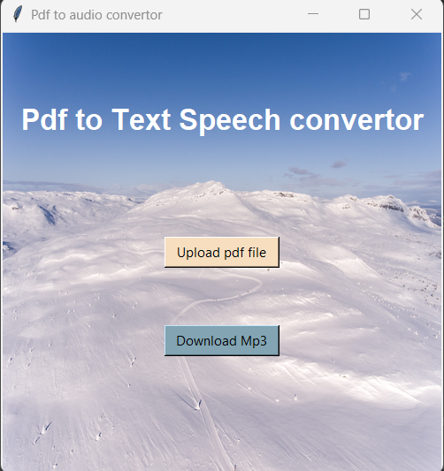
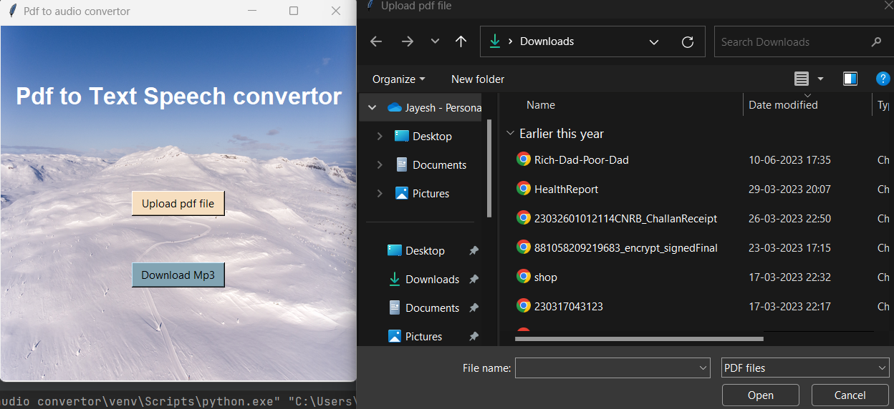
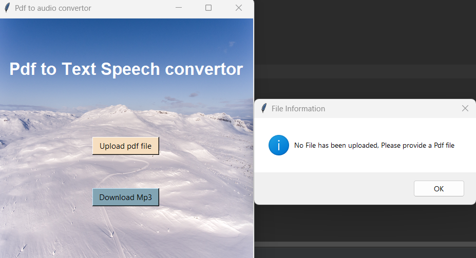
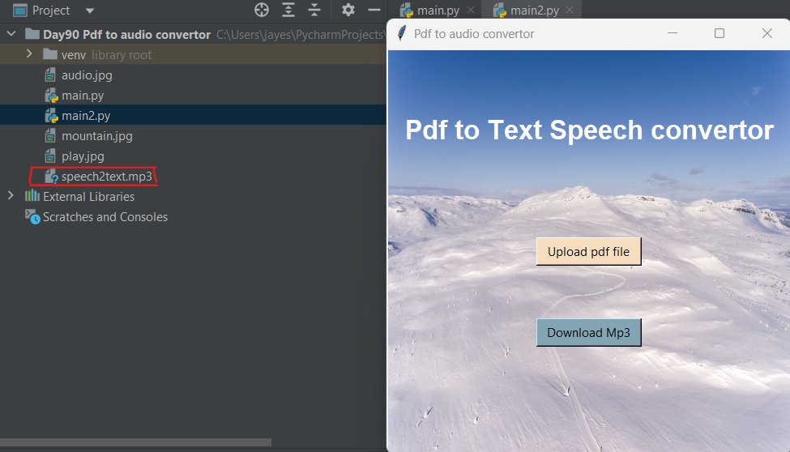
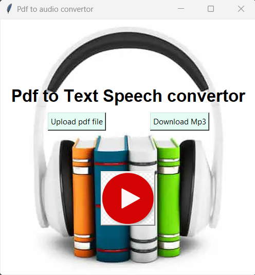
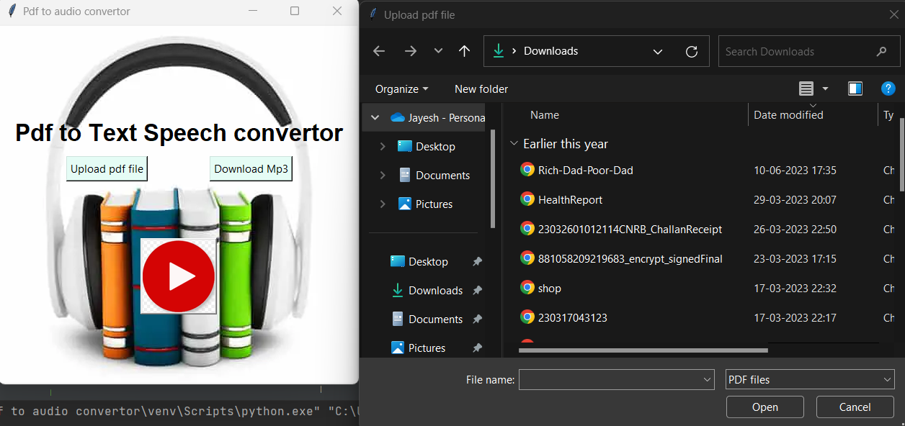
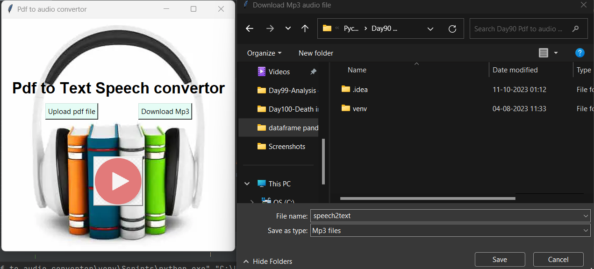
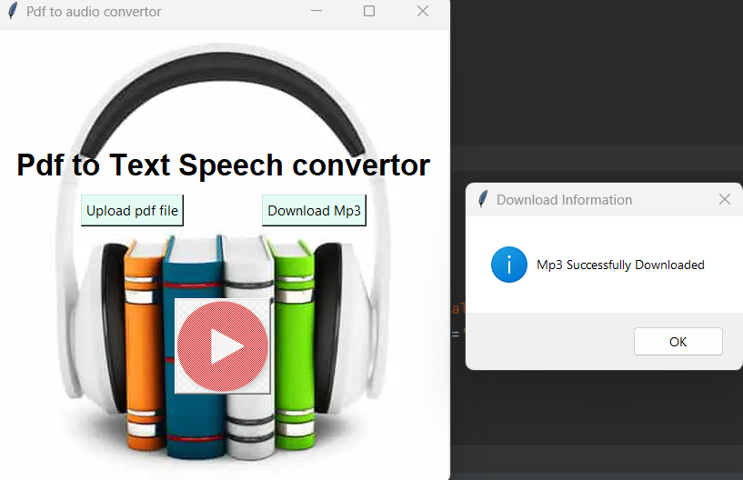

# PDF to Speech Converter 📚🔊

This is a simple Python application that converts PDF documents into speech. It provides two options for text-to-speech conversion:

1. Using PyPDF2 and the VoiceRSS API for online speech synthesis. 🌐🎙️
2. Using pyttsx3 for offline speech synthesis. 🖥️🔊

## Prerequisites 🛠️

Before running this application, make sure you have the following dependencies installed:

- Python 3.x
- PyPDF2
- tkinter (usually included with Python)
- pyttsx3 (for the second option)
- requests (for the VoiceRSS API)

You can install the necessary packages using pip:

- `pip install PyPDF2`
- `pip install pyttsx3`
- `pip install requests`

## Usage 🚀

### Option 1: Using PyPDF2 and VoiceRSS API

1. Create an account on [VoiceRSS](http://www.voicerss.org/) to obtain your API key.
2. Open the python script and replace `'YOUR_API_KEY'` with your actual VoiceRSS API key.
3. Use the tkinter GUI to select a PDF file and convert it to speech which is downloaded as mp3 file. 📑➡️🔊

### Option 2: Using pyttsx3

1. Run the application by executing python script.
2. Use the tkinter GUI to select a PDF file and convert it to speech.
3. Make sure your system has text-to-speech voices installed for pyttsx3 to work correctly.
4. You can also play the audio without downloading the MP3 file. 🎶

## How It Works 🛠️🔍

- For Option 1, the PyPDF2 library is used to extract text from the selected PDF file. The extracted text is then sent to the VoiceRSS API for speech synthesis.
- For Option 2, pyttsx3 is used for offline speech synthesis. It directly converts the extracted text from the PDF file into speech. It can play audio of the extracted text. 🔊📖

## Example of Application (Option 1 - Using API) 🌐🎙️

### Interface:

### Uploading a PDF:

### No file Detection:

### Downloading the Result:

## Example of Application (Option 2) 🖥️🔊

### Interface:

### Uploading a PDF:

### Downloading the Result:
In this option, you can play the audio without downloading the mp3 file by clicking the red button.

